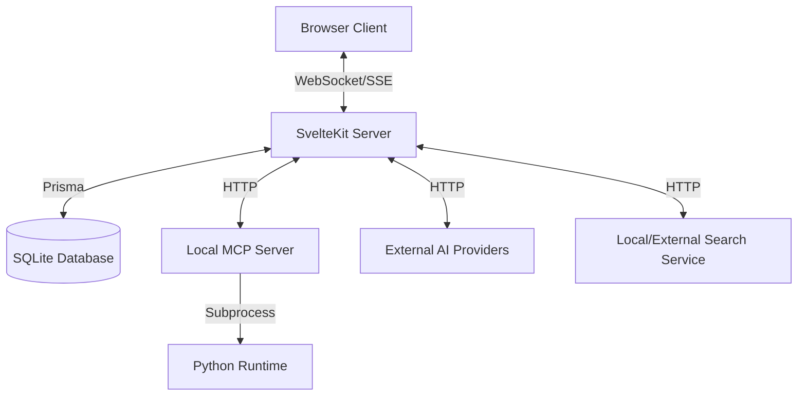

# WebChat Application - Detailed Design Document

## 1. Executive Summary
This document provides a comprehensive technical analysis of the **WebChat** application. The system is a modern, full-stack AI chat interface built with **SvelteKit**, designed to provide a premium user experience similar to ChatGPT or Claude. It features real-time streaming, multi-model support, local tool execution (MCP), and an integrated web search capability.

## 2. System Architecture

### 2.1 High-Level Architecture
The application follows a monolithic structure with a tightly integrated frontend and backend, leveraging SvelteKit's capabilities.

### 2.2 Technology Stack
- **Frontend**: Svelte 5, Tailwind CSS, shadcn-svelte (UI Components), Lucide Icons.
- **Backend Framework**: SvelteKit (Node.js runtime).
- **Language**: TypeScript (Full stack), Python (Local MCP Server).
- **Database**: SQLite (via Prisma ORM).
- **Authentication**: Lucia Auth (v3) with Prisma Adapter.
- **AI Integration**: OpenAI-compatible API client, Server-Sent Events (SSE) for streaming.
- **Tools Protocol**: Custom JSON-based tool calling and Model Context Protocol (MCP) integration.

## 3. Core Modules

### 3.1 Authentication Module
- **Library**: Lucia Auth v3.
- **Storage**: Sessions stored in `AuthSession` table in SQLite.
- **Mechanism**: Cookie-based session authentication.
- **Features**: 
  - User registration and login.
  - Role-based access control (`user`, `admin`).
  - Secure session management with expiration.

### 3.2 Chat Engine
The core of the application, handling real-time communication with AI models.

- **Endpoint**: `/api/chat/[id]`
- **Flow**:
  1.  **Request**: User sends message + model preference + optional web search mode.
  2.  **Validation**: Server verifies auth and loads user preferences (`defaultModel`).
  3.  **Context**: Fetches recent history (up to 10 messages) from `Message` table.
  4.  **Prompting**: Constructs system prompt, including Tool Definitions (Web Search, Execute Python).
  5.  **Inference**:
      - **Standard**: Calls `ModelConfig.baseUrl` (e.g., OpenAI, OpenRouter).
      - **O1/O3 Models**: Handles `reasoning_effort` parameter.
      - **MCP**: Proxies request to local MCP providers if configured.
  6.  **Streaming & Tooling**: 
      - Streams response to client.
      - Detects JSON tool calls (e.g., `{"tool": "web_search"}`).
      - **Server-Side Execution**: If tool detected, pauses stream, executes tool (via `http://127.0.0.1:33333` for MCP or internal logic), and appends result to the conversation.
  7.  **Persistence**: Saves User and Assistant messages to DB.

### 3.3 Web Search Integration
A specialized module for retrieving and analyzing real-time information.

- **Trigger**: Explicit toggle by user or autonomous tool call by AI.
- **Process**:
  1.  **Analysis**: AI analyzes user query to generate optimal search keywords (JSON output).
  2.  **Execution**: Calls external search API (or local service at port 5100).
  3.  **Content Fetching**: Retrieves full text of relevant URLs via `/api/fetch-url`.
  4.  **Synthesis**: AI summarizes search results and content into a final answer.
- **UI**: Dedicated `SearchProgressDisplay` showing steps (Analyzing -> Searching -> Fetching).

### 3.4 Local MCP Server (`server/mcp_server.py`)
A standalone Python script acting as a tool provider.
- **Protocol**: HTTP-based JSON-RPC style (or simple REST).
- **Tools Provided**:
  - `execute_python`: Runs Python code in a subprocess (Note: Unsafe/Development only).
  - `list_dir`, `read_file`: Filesystem access.
  - `install`: Package management (`uv pip install`).
- **Integration**: The SvelteKit server calls this local server to execute code generated by the AI.

## 4. Data Model (Prisma)

The database schema (`src/lib/db/schema.prisma`) supports multi-user, multi-session, and multi-provider configurations.

| Model | Description | Key Fields |
|-------|-------------|------------|
| `User` | Application users | `email`, `passwordHash`, `defaultModel`, `searchModel` |
| `AuthSession` | Active login sessions | `userId`, `expiresAt` |
| `Session` | Chat conversations | `title`, `userId`, `messages` |
| `Message` | Chat log | `role` (user/assistant), `content`, `sessionId` |
| `Provider` | AI Service Provider | `name`, `baseUrl`, `apiKey` |
| `ModelConfig` | Specific Model Settings | `name`, `model` (ID), `temperature`, `maxTokens` |

## 5. User Interface Design

### 5.1 Chat Interface (`+page.svelte`)
- **Layout**: Responsive, viewport-aware height (mobile friendly).
- **Components**:
  - `ChatBubble`: Renders Markdown/LaTeX messages with syntax highlighting.
  - `ModelSelector`: Dropdown to switch models dynamically.
  - `SearchProgressDisplay`: Visual feedback for long-running search tasks.
- **State Management**: Uses Svelte stores (`sessionsStore`, `selectedModel`) for cross-component state.
- **Streaming**: Uses `TextDecoder` to parse streaming text and handle `<think>` blocks for reasoning models.

### 5.2 Key Features
- **Auto-Title**: Automatically generates chat titles via background API call (`/api/chat/[id]/generate-title`).
- **Markdown & Math**: Supports extensive formatting via `marked` and `katex`.
- **Draft Saving**: LocalStorage-based draft persistence.

## 6. Security Considerations
- **Tool Safety**: The `execute_python` tool allows arbitrary code execution. **Critical Risk**: Currently designed for local/dev use only. Needs sandboxing (Docker/gVisor) for production.
- **API Keys**: Stored in `Provider` table. Should be encrypted at rest.
- **SSRF**: `/api/fetch-url` could be used for SSRF. Needs whitelist/validation.

## 7. Future Recommendations
1.  **Sandboxing**: Isolate Python execution environment.
2.  **Vector Store**: Implement RAG pipeline using a vector database for long-term memory.
3.  **Auth Hardening**: Add OAuth providers (Google, GitHub).
4.  **Deployment**: Dockerize the Setup (Frontend + Python MCP + DB) for easier distribution.
